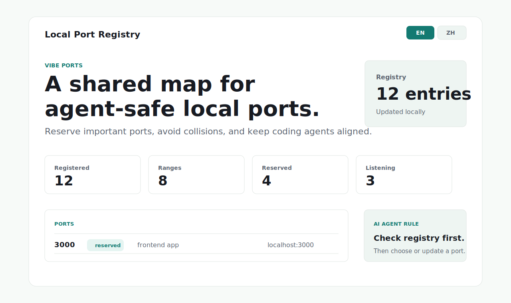

# Local Port Registry Skill

一个给 AI coding agent 使用的本地端口管理 skill。

它的目标很简单：当 AI 在本地创建服务、修改 `.env`、改 `package.json` scripts、启动 Next.js / Vite / API / worker / dashboard 服务时，不要随手复用 `3000`、`3001`、`5173`、`8000` 这些默认端口，而是先查看用户的本地端口约定，再选择安全端口。

## 复制到 Codex

把 `local-port-registry/SKILL.md` 复制到：

```txt
~/.codex/skills/local-port-registry/SKILL.md
```

然后开启新的 Codex 会话，让 Codex 重新发现这个 skill。

也可以用命令复制：

```bash
mkdir -p ~/.codex/skills/local-port-registry
cp local-port-registry/SKILL.md ~/.codex/skills/local-port-registry/SKILL.md
```

## 复制到其他 AI Agent

如果你的工具不支持 Codex skill 目录，可以直接把 `local-port-registry/SKILL.md` 的内容复制到：

- 全局规则
- 项目规则
- agent instructions
- system prompt

适合放到 Claude Code、Cursor Agent、Gemini CLI、OpenCode、OpenClaw 或其他会修改本地项目端口配置的 AI coding 工具里。

## 它会让 AI 做什么

- 创建或修改本地服务前，先检查端口约定。
- 尊重用户预留端口，例如某个项目固定使用 `3000`。
- 区分 `reserved`、`preferred`、`assigned`、`blocked`。
- 在 Linux / macOS 上检查端口是否已经被监听。
- 不主动 kill 占用端口的进程，除非用户明确要求。
- 修改端口后，更新本地 registry，方便下一次 agent 继续遵守。

## 可视化参考

完整的本地工具可以渲染类似这样的端口看板；这个仓库只提供 skill 本身和一张静态参考图。



## English

This repository distributes a single AI-agent skill for local port management.

Copy `local-port-registry/SKILL.md` into:

```txt
~/.codex/skills/local-port-registry/SKILL.md
```

Then start a new Codex session so the skill can be discovered.

For other AI coding agents, paste the contents of `local-port-registry/SKILL.md` into global rules, project rules, agent instructions, or the system prompt.

The skill tells agents to check local port reservations and runtime listeners before choosing or changing development ports.
